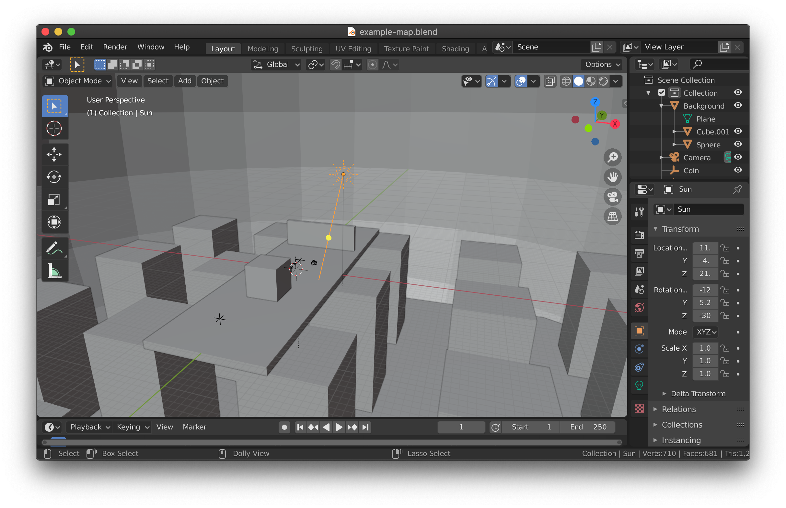
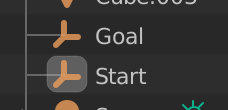
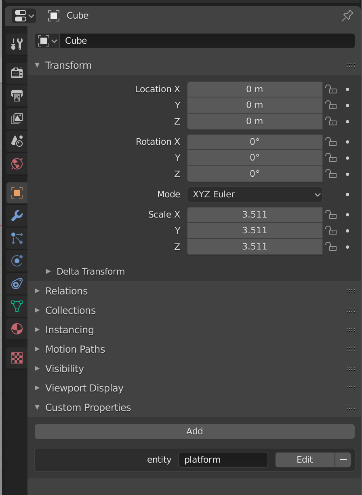

# Marble Mouse Custom Level Guide

- Marble Mouse levels are created in Blender and exported in the `.glb` format.
- Levels can either be shared directly as a file or submitted to [Marble Mouse World](https://github.com/rameshvarun/marble-mouse-world) for anyone to play.

## How to Load Custom Levels
- Custom levels are contained within `.glb` files which package all mesh data and textures.
- Select `Load Custom Level` from the main menu, or simply hit `F1` to launch a file dialog.
- Select the `.glb` and the game will load the level.

## How to Make Custom Levels
Levels can be created in Blender. Check the provided example `example-map.blend` and `example-map.glb` for an example of what you can do with custom maps.

### Start and Goal Positions
Place two empties - one named `Start` and another named `Goal`. The game will use the location of these nodes to determine where the level starts and ends.

### Platforms
First place your meshes. For each mesh that is collidable, go to the `Object Properties` tab of the property editor window. Add the custom property `entity` and set it equal to `platform`.

### Coins

Place empties with the custom property `entity` set to `coin`.

### Moving / Rotating Platforms

On any object with `entity` set to `platform`, you can add two additional properties `position` and `rotation`. These properties are mathematical expressions that encode the position (in cartesian coordinates) and rotation (in euler angles) of a platform as a function of time `t`. These expressions are evaluated using [mathjs](https://mathjs.org/docs/expressions/syntax.html).

- `init + [5 * sin(t), 0, 0]` is an example position expression. The platform moves left and right around it's initial position.
- `init + [0, t, 0]` is an example rotation expresion. The platform continually rotates around the Y-axis.

### Exporting

Once done, you can export your level using Blender's built-in glTF exporter.
- Select `Format > glTF Binary (.glb)`
- Check `Include > Custom Properties`
- Check `Geometry > Apply Modifiers`
